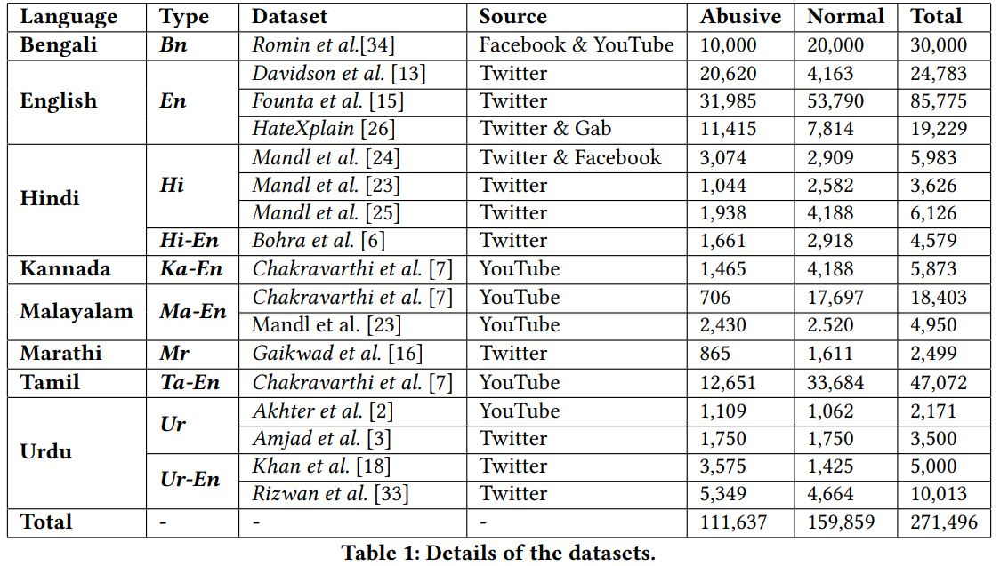

-----------------------------------------
***Datasets used for our task***
------------------------------------------
1. **Bengali**

   **(Bn) [Romin et al.](https://arxiv.org/ftp/arxiv/papers/2012/2012.09686.pdf)** --> [Dataset Link](https://www.kaggle.com/datasets/naurosromim/bengali-hate-speech-dataset)
   
2. **English**

   **(En) [Davidson et al.](https://arxiv.org/pdf/1703.04009.pdf)** --> [Dataset Link](https://github.com/t-davidson/hate-speech-and-offensive-language)
   
   **(En) [Founta et al.](https://arxiv.org/abs/1802.00393)** --> [Dataset Link](https://dataverse.mpi-sws.org/dataset.xhtml?persistentId=doi:10.5072/FK2/ZDTEMN)
   
   **(En) [HateXplain](https://arxiv.org/abs/2012.10289)** --> [Dataset Link](https://github.com/hate-alert/HateXplain/tree/master/Data)

3. **Hindi**

   **(Hi) [Mandl et al.](https://dl.acm.org/doi/pdf/10.1145/3503162.3503176)** --> [Dataset Link](https://hasocfire.github.io/hasoc/2021/index.html)
   
   **(Hi) [Mandl et al.](https://dl.acm.org/doi/abs/10.1145/3441501.3441517)** --> [Dataset Link](https://hasocfire.github.io/hasoc/2020/index.html)
   
   **(Hi) [Mandl et al.](http://ceur-ws.org/Vol-2517/T3-1.pdf)** --> [Dataset Link](https://hasocfire.github.io/hasoc/2019/dataset.html)
   
   **(Hi-En) [Bohra et al.](https://aclanthology.org/W18-1105.pdf)** --> [Dataset Link](https://aclanthology.org/W18-1105.pdf) (Contact the Authors)
   
4. **Kannada**

   **(Ka-En) [Chakravarthi et al.](https://aclanthology.org/2021.dravidianlangtech-1.17/)** --> [Dataset Link](https://competitions.codalab.org/competitions/27654)
   
5. **Malayalam**

   **(Ma-En) [Chakravarthi et al.](https://aclanthology.org/2021.dravidianlangtech-1.17/)** --> [Dataset Link](https://competitions.codalab.org/competitions/27654)
   
   **(Ma-En) [Mandl et al.](https://dl.acm.org/doi/abs/10.1145/3441501.3441517)** --> [Dataset Link](https://competitions.codalab.org/competitions/25295)
 
6. **Marathi**

   **(Mr) [Gaikwad et al.](https://arxiv.org/abs/2109.03552)** --> [Dataset Link](https://github.com/tharindudr/MOLD)
   
7. **Tamil**

   **(Ta-En) [Chakravarthi et al.](https://aclanthology.org/2021.dravidianlangtech-1.17/)** --> [Dataset Link](https://competitions.codalab.org/competitions/27654)
   
8. **Urdu**

    **(Ur) [Akhter et al.](https://ieeexplore.ieee.org/document/9094176)** --> [Dataset Link]( https://github.com/pervezbcs/Urdu-Abusive-Dataset)
   
   **(Ur) [Amjad et al.](https://dl.acm.org/doi/abs/10.1145/3503162.3505241)** --> [Dataset Link](https://www.urduthreat2021.cicling.org/)
   
   **(Ur-En) [Khan et al.](https://dl.acm.org/doi/10.1145/3414524)** --> [Dataset Link](https://www.kaggle.com/datasets/drkhurramshahzad/hate-speech-roman-urdu)
   
   **(Ur-En) [Rizwan et al.](https://aclanthology.org/2020.emnlp-main.197/)** --> [Dataset Link](https://github.com/haroonshakeel/roman_urdu_hate_speech)
   
  
 

